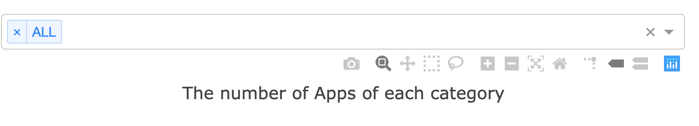
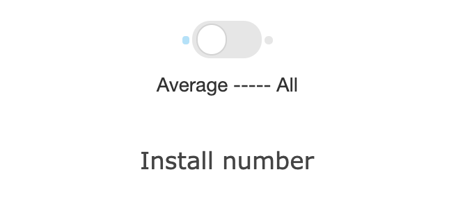
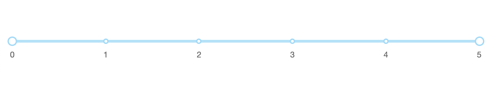
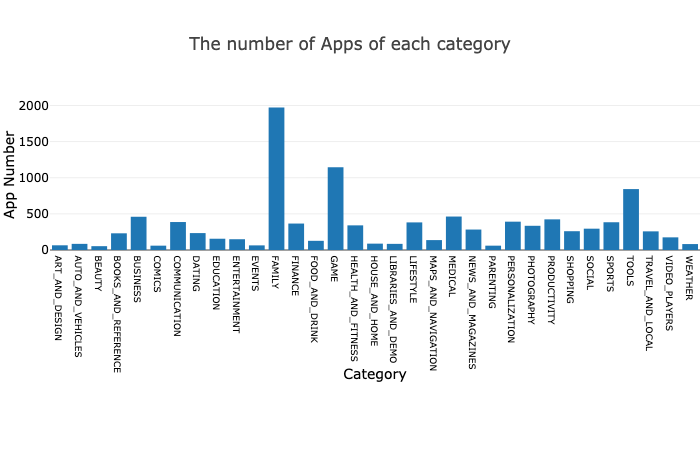
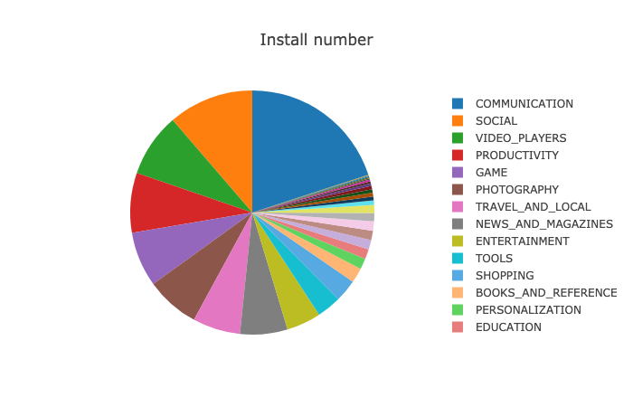
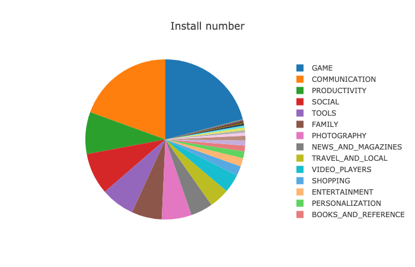
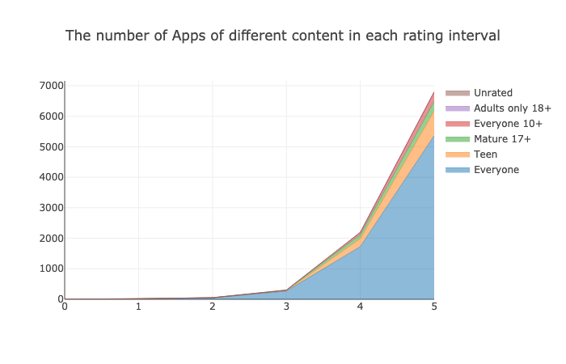
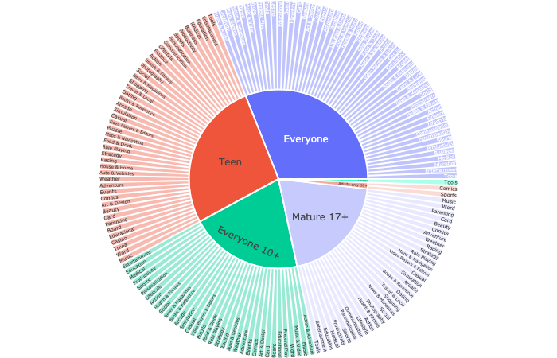
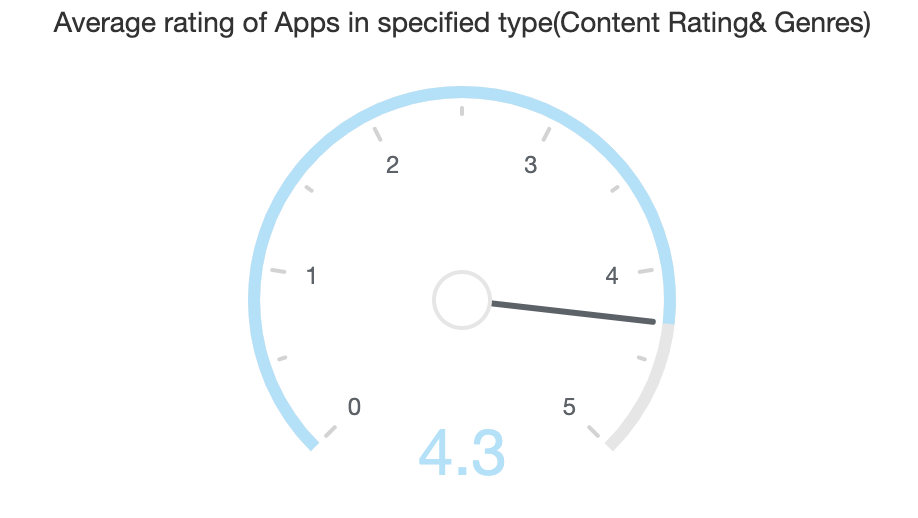

# Data Visualization

1753837 陈柄畅

## Requirement

* pandas
* dash
* plotly
* **dash_daq**

## How to run

```shell
python lab3-dashboard_example.py
```

Then go to `http://127.0.0.1:8050`.

## Notes

* The orgin csv file has some unreadable code. So instead, I find a same file on Github and analyze with it.
* The codes about pre-processing data is in `extract_information.ipynb`. The codes visualizing data is in `lab3-dashboard_example.py`.
* First time opening the page may take some time.

## Layout

* You can select what category you want to see.



* You can choose to show pie chart of average install number of each category or all install number of each category.



* You can choose the scale of rates shown in chart above.



## Executive Summary

Google play is a digital distribution service. Until 2017, there has already been over 3.5 million apps on Google play. The potential rules may help developers to achieve great success and capture the Android market. This report discusses my findings.

## Dataset

There are 10842 records in the csv file. Each records contains the information about App Name, Category, Rating, Reviews, Size, Installs, Type, Price, Content Rating, Genres, Last Updated, Current Ver, Android Ver of each app. However, some records may not have value in some columns, such No.1555 app, Market Update Helper, has null in column `Current Ver`. But it doesn't affect the overall result.

## Analysis

First, I analyze the relationship between app number and category.



From the chart, we can see that App number of `FAMILY` , `GAME` and `TOOLS` is the top three largest ones. Apparently, app developers who develop these kinds of apps may meet more competition.

Accordingly, I visualized the average and all install number of each category. The former is `average` one and the latter is `all` one.





From these charts, we can see that `GAME`, `COMMUNICATION`, `PRODUCTION` and `SOCIAL` share more than half of the market. If we associate these two charts, we can find different characteristic of each category. Apps about `GAME` has large market and people prefer to install various games. Oppositely, apps about `COMMUNICATION` also has very large market but some sepecified apps may take most of it. So developers may achieve success  more easily by developing games than developing communication apps. Meanwhile, high possibility of success is along with more intense competition.

Then I anaylze how apps' content rating and genres affect apps' rating.



I found that most of apps are rated more than 4. So generally, people are satisfied with current apps.



User can hover on diffent part and the dashboard above will show average rating of this part. We can see that apps with different content ratings have similar rating between 4.1 and 4.3. So app customers don't rate apps according to their content rating and genres, which give developers a lot of choices.




## Code

* Draw bar charts according to selected categories.

```python
@app.callback(
    Output('apps-count-bar', 'figure'),
    [Input('category_selected', 'value')]
)
def update_apps_count_bar(category_list):
    sorted_categories = sorted(category_list)
    if len(sorted_categories) == 0:
        sorted_categories.append('ALL')
    if sorted_categories[0] == 'ALL':
        return {
            'data': [
                go.Bar(
                    x=category[1:],
                    y=[data['Category'].value_counts()[c] for c in category[1:]]
                )
            ],
            'layout': go.Layout(
                xaxis={
                    'title': 'Category',
                    'titlefont': {'color': 'black', 'size': 14},
                    'tickfont': {'size': 9, 'color': 'black'}
                },
                yaxis={
                    'title': 'App Number',
                    'titlefont': {'color': 'black', 'size': 14, },
                    'tickfont': {'color': 'black'}
                },
                margin={'l': 50, 'b': 200, 't': 100, 'r': 0},
                hovermode='closest',
                title='The number of Apps of each category'
            )
        }
    else:
        return {
            'data': [
                go.Bar(
                    x=category_list,
                    y=[data['Category'].value_counts()[c] for c in sorted_categories]
                )
            ],
            'layout': go.Layout(
                xaxis={
                    'title': 'Category',
                    'titlefont': {'color': 'black', 'size': 14},
                    'tickfont': {'size': 9, 'color': 'black'}
                },
                yaxis={
                    'title': 'App Number',
                    'titlefont': {'color': 'black', 'size': 14, },
                    'tickfont': {'color': 'black'}
                },
                margin={'l': 50, 'b': 200, 't': 100, 'r': 0},
                hovermode='closest',
                title='The number of Apps of each category'
            )
        }
```

* Draw pie charts according to selected categories.

```python
@app.callback(
    Output('installs-count-pie', 'figure'),
    [Input('average_or_all', 'value'),
     Input('category_selected', 'value')]
)
def update_average_or_all(average_all, category_list):
    sorted_categories = sorted(category_list)
    if len(sorted_categories) == 0:
        sorted_categories.append('ALL')
    if average_all:
        if sorted_categories[0] == 'ALL':
            return {
                'data': [go.Pie(
                    labels=category[1:],
                    values=[cat_dic[c] for c in category[1:]],
                    hoverinfo='label+percent+value',
                    textinfo='none'
                )],
                'layout': {
                    'title': 'Install number',
                    'height': 450
                }
            }
        else:
            return {
                'data': [go.Pie(
                    labels=sorted_categories,
                    values=[cat_dic[c] for c in sorted_categories],
                    hoverinfo='label+percent+value',
                    textinfo='none'
                )],
                'layout': {
                    'title': 'Install number',
                    'height': 450
                }
            }
    else:
        if sorted_categories[0] == 'ALL':
            return {
                'data': [go.Pie(
                    labels=category[1:],
                    values=[int(cat_dic[c] / data['Category'].value_counts()[c]) for c in category[1:]],
                    hoverinfo='label+percent+value',
                    textinfo='none'
                )],
                'layout': {
                    'title': 'Install number'
                }
            }
        else:
            return {
                'data': [go.Pie(
                    labels=sorted_categories,
                    values=[int(cat_dic[c] / data['Category'].value_counts()[c]) for c in sorted_categories],
                    hoverinfo='label+percent+value',
                    textinfo='none'
                )],
                'layout': {
                    'title': 'Install number'
                }
            }


```

* Draw line chart according to rating.

```python
@app.callback(
    Output('rating-content-line', 'figure'),
    [Input('rating-slider', 'value')]
)
def update_rating_content_line(rates):
    return {
        'data': [
            dict(
                name=content_list[0],
                x=[num for num in range(rates[0], rates[1] + 1)],
                y=[len(rating_split[num][rating_split[num]['Content Rating'] == content_list[0]]) for num in
                   range(rates[0], rates[1] + 1)],
                hoverinfo='x+y',
                line=dict(width=0.5),
                stackgroup='one'
            ),
            dict(
                name=content_list[1],
                x=[num for num in range(rates[0], rates[1] + 1)],
                y=[len(rating_split[num][rating_split[num]['Content Rating'] == content_list[1]]) for num in
                   range(rates[0], rates[1] + 1)],
                hoverinfo='x+y',
                line=dict(width=0.5),
                stackgroup='one'
            ),
            dict(
                name=content_list[2],
                x=[num for num in range(rates[0], rates[1] + 1)],
                y=[len(rating_split[num][rating_split[num]['Content Rating'] == content_list[2]]) for num in
                   range(rates[0], rates[1] + 1)],
                hoverinfo='x+y',
                line=dict(width=0.5),
                stackgroup='one'
            ),
            dict(
                name=content_list[3],
                x=[num for num in range(rates[0], rates[1] + 1)],
                y=[len(rating_split[num][rating_split[num]['Content Rating'] == content_list[3]]) for num in
                   range(rates[0], rates[1] + 1)],
                hoverinfo='x+y',
                line=dict(width=0.5),
                stackgroup='one'
            ),
            dict(
                name=content_list[4],
                x=[num for num in range(rates[0], rates[1] + 1)],
                y=[len(rating_split[num][rating_split[num]['Content Rating'] == content_list[4]]) for num in
                   range(rates[0], rates[1] + 1)],
                hoverinfo='x+y',
                line=dict(width=0.5),
                stackgroup='one'
            ),
            dict(
                name=content_list[5],
                x=[num for num in range(rates[0], rates[1] + 1)],
                y=[len(rating_split[num][rating_split[num]['Content Rating'] == content_list[5]]) for num in
                   range(rates[0], rates[1] + 1)],
                hoverinfo='x+y',
                line=dict(width=0.5),
                stackgroup='one'
            )
        ],
        'layout': {
            'title': 'The number of Apps of different content in each rating interval'
        }
    }
```

* Change dashboard value according to different parts hovered on.

```python
@app.callback(
    Output('rating-gauge', 'value'),
    [Input('content-genres-sunburst', 'hoverData')]
)
def update_content_genres_sunburst(hoverData):
    if hoverData is None:
        return 0
    else:
        print(hoverData)
        return scores[hoverData['points'][0]['pointNumber']]
```


