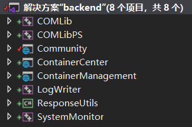
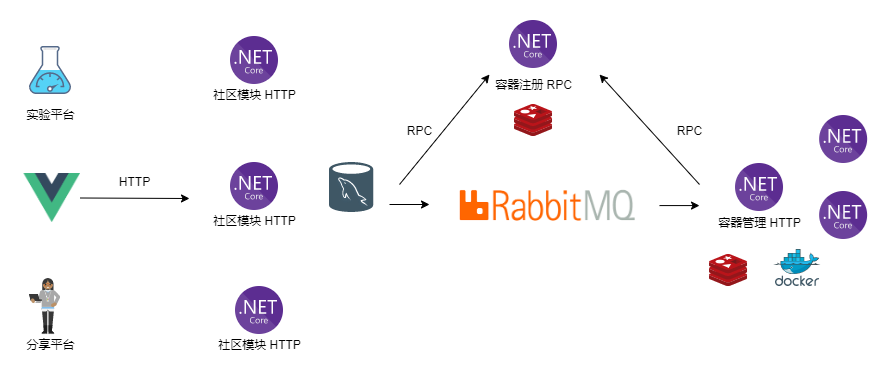
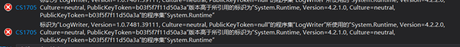

# MLab——机器学习与分享平台

> 同济大学2019-2020春季学期 .Net课程期末项目
>
> 1753837 陈柄畅

[TOC]


## 项目背景

在学习机器学习相关知识的过程中，初学者往往面临着两个比较麻烦的问题。

1. 分享难：对于网络上博客上分享的教程或者课堂上老师演示样例，初学者往往需要配置环境。环境的配置对于初学者是一件很麻烦的事，有时会出现难以发现原因的bug。
2. 设备差：机器学习往往需要性能较好的机器，而可能由于便携性或者资金的问题，机器学习初学者可能面临设备的瓶颈。

针对这两个场景，于是我设计并实现了MLab项目。

## 主要完成的工作

### 模块

项目主要分为两个模块：

1. 实验平台：基于docker进行虚拟化的jupyter notebook在线运行平台。
2. 分享平台：机器学习知识以及容器分享的社区平台。

同时，两个模块之间是可以互通的。通过分享平台中帖子所绑定的容器，用户可以直接复制帖子中的容器，并在实验平台上运行。

### 主要功能

#### 实验平台

1. 创建容器
2. 启动容器
3. 连接容器
4. 删除容器
5. 关闭容器
6. 日志下载

#### 分享平台

1. 发帖
2. 看帖
3. 查看帖子详情
4. 搜索帖子
5. 点赞
6. 评论
7. 复制容器

### 前端工作量

前端实现了12个页面

### 后端工作量

后端实现了30个Rest API，2个Rpc调用以及1个RabbitMq的消费者监听。

### 程序集



MLab项目实现了7个程序集。其中COMLib为COM组件项目，Community, ContainerCenter 和 ContainerManagement 为 Asp.Net Core Web Api项目，LogWriter为C++/CLI项目，ResponseUtils为.Net Standard2.0的共享程序集，SystemMonitor为Win32dll项目。

### 项目架构



项目前端采用Vue实现，社区模块，容器注册，容器管理为三个独立的.Net Core应用，可以分别部署。

社区模块使用 EntityFramework Core 作为 ORM 框架。容器管理使用 Redis 缓存容器映射端口号，同时使用 Dotnet Docker进行容器管理。社区模块与容器管理之间没有紧密的联系，且容器管理应用的数量往往远大于社区模块，所以如果直接使用http调用，可能会导致两者之间不必要的耦合。所以，我采用了 RabbitMq 作为消息队列，用户在创建容器时，有社区模块向消息队列中发布一条消息，由 RabbitMq 进行负载均衡，由一个容器管理应用获取到这条消息，然后创建容器。

但这样导致一个问题，社区模块无法得知指定容器在哪一台服务器上，所以需要容器管理应用和社区模块向统一的容器注册中心获取和发布信息。容器注册中心使用 Redis 缓存和持久化注册信息，并使用gRpc提供注册和获取服务。

## 特色与创新之处

1. 使用Docker作为虚拟化

   Docker作为虚拟化，其性能相较于虚拟机有了很大的提升。同时，基于Jupyter官方提供的镜像，我进行了相关配置，开发远程访问，生成新的基础镜像。

2. 使用gRpc作为容器注册中心的服务形式

   gRpc的性能相较于http有很大的提升，所以对于需要频繁调用的容器注册中心服务，采用gRpc的服务形式，可以大大提升应用性能。

3. 使用RabbitMq进行解耦

   特定社区模块和特定容器管理之间没有紧密联系，但两者之间仍需要通信，所以采用RabbitMq进行解耦。

4. 使用Redis进行缓存和持久化

   容器注册中心需要保存并提供注册信息的快速查询，所以采用Redis实现。既可以缓存，避免存在磁盘上，花费大量时间查找，又可以持久化，避免应用重启导致注册信息丢失。

## 项目要求完成度

1. 使用COM组件实现哈希端口的操作。
2. 使用C++/CLI使用日志写入
3. 使用Win32Dll实现内存监控
4. 使用共享程序集使用HTTP结果标准化
5. 多线程主要应用在两个方面：
   1. 数据库访问，Docker操作，HTTP请求均采用异步操作
   2. .Net Core Background Service 启动消息队列监听和容器注册

## 碰到的难题与解决

1. COM组件：未能注册输出。请尝试启用“逐用户重定向”，或者使用提升的权限从命令提示符处注册该组件。

   解决：普通用户权限不够，无法注册COM组件，需在属性中开启逐用户重定向，使用管理员权限。

2. System.Text.Json.JsonException: A possible object cycle was detected which is not supported. This can either be due to a cycle or if the object depth is larger than the maximum allowed depth of 32. 

   解决：System.Text.Json序列化对象深度有限，

   使用NewtonSoft.Json 替代

   ```c#
   services.AddControllersWithViews()
   
     .AddNewtonsoftJson(options =>
   
     options.SerializerSettings.ReferenceLoopHandling = Newtonsoft.Json.ReferenceLoopHandling.Ignore
   
   );
   ```

3. 

   解决：两个程序集目标框架不同，同时，.Net Core仅从3.1版本开始支持C++/CLI