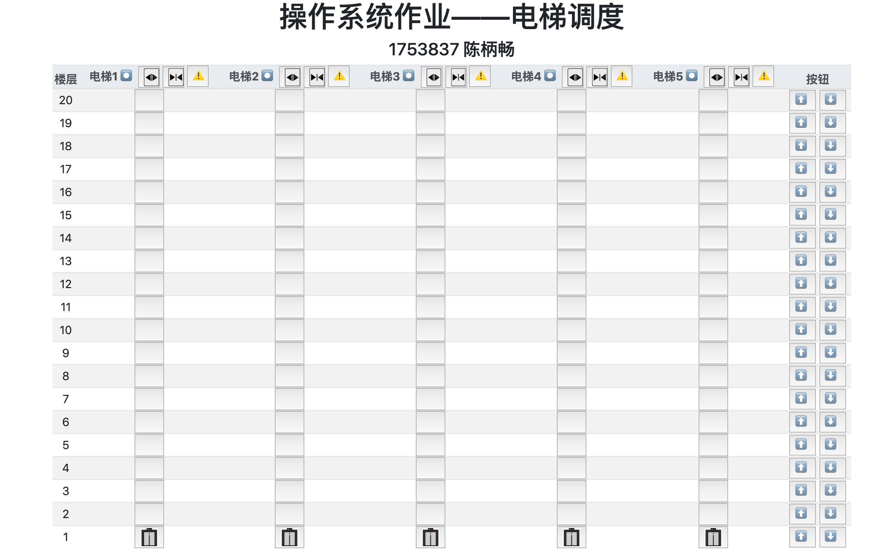
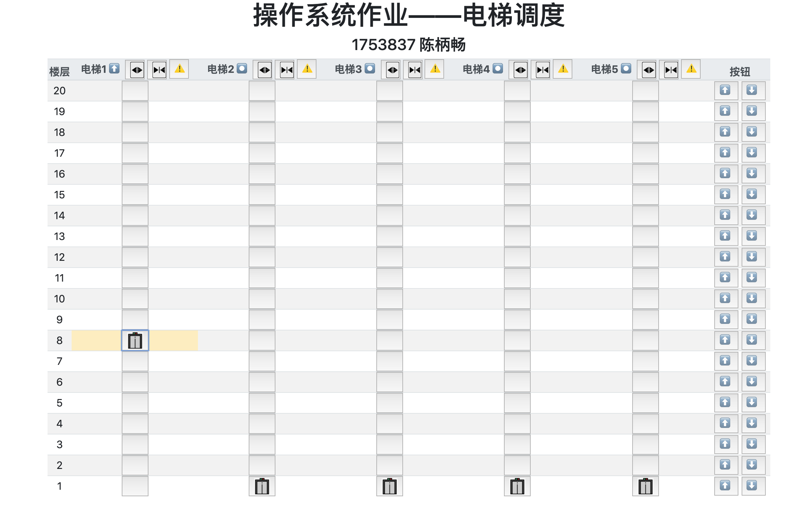
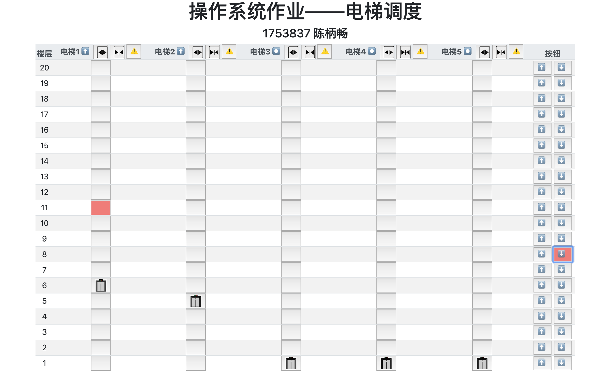
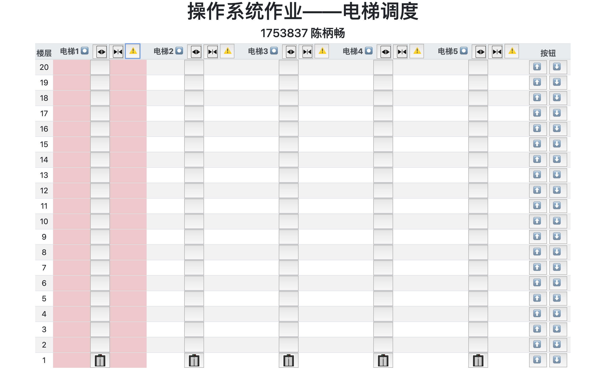
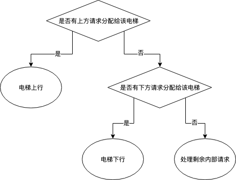
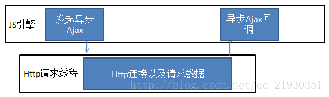
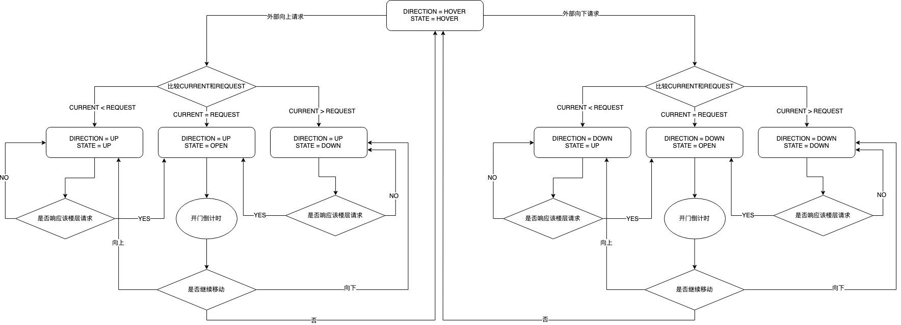

# 电梯调度

操作系统作业

**陈柄畅 1753837**

## 1. 场景描述

某一幢楼有二十层楼，有五部互联的电梯。

## 2. 开发环境

开发浏览器：Chrome 73.0.3683.103（64 位）

开发语言：HTML, CSS, JavaScript

## 3. 使用

使用浏览器打开`index.html`

## 4. UI界面解释



* 使用HTML中的`table`表示建筑。
* 第一列表示楼层。
* 第二至六列表示五部电梯及其内部按键 e.g 点击第i+1行第j+1列的按钮相当于点击了第j个电梯内部的第21-i层按钮。
* 最后一列为每层楼外部的上下行按钮。
* 电梯名旁的符号表示电梯状态：
  * ⏺ 表示电梯处于悬停状态
  * ⬇️ 表示电梯处于下行状态
  * ⬆️ 表示电梯处于上行状态
* 当电梯所在格为黄色时，表示电梯门打开。如下图所示，第一部电梯在8楼打开电梯门。



* 当按钮显示为红色时，即按钮已被按下。



* 当按下报警键时，电梯所在列会红色闪烁一次，随后保持红色，即此时该电梯无法使用。



## 5. 算法

### 5.1 调度说明

#### 5.1.1 分配算法

首先，根据用户请求的来源，可以将用户请求分为内部请求和外部请求。

对于内部请求处理较为简单，即当请求发送后，立即进入电梯内部的任务队列，等待被执行。

对于外部请求，当请求发生时，根据其是否是上行或者下行，将其压入外部总任务队列的`upQueue` 上行任务队列中或`downQueue`下行任务队列中。接着由总控程序，每0.5s分别检查一次两个队列中是否还有未分配的任务。分配的总体原则采用就近分配的方法，但对于不同方向的分配仍有所不同。

* 上行：只有处于悬停状态（***电梯状态转移详见5. 3***）或者正在处理上行任务且此时电梯所在楼层小于请求所在楼层的电梯才有资格进入距离的比较，再从中选取最近的进行分配。
* 下行：只有处于悬停状态或者正在处理下行任务且此时电梯所在楼层大于请求所在楼层的电梯才有资格进入距离的比较，再从中选取最近的进行分配。

当请求分配完成后，该楼层该方向的状态量（***状态量详见5.4***）将被置为分配电梯的`id`。如果该电梯没有运行，则运行该电梯。但初始分配并不是最终决定发起该请求的用户进入哪一个电梯，如果原始分配的电梯由于开门时间过长等不可控原因，原始电梯可能无法处理请求或者不是处理请求的最好选择，就会发生电梯之间抢占任务的现象，这样可以大大减少用户的等待时间。本算法简单考虑两种抢占情况：

* 电梯开门时间过长：电梯由于在前往请求楼层的过程中时间过长，可能导致分配任务时远于该电梯的电梯优先到达请求楼层。如果先到达的电梯同样有处理该请求的资格，该任务将被先到的电梯抢占。
* 电梯报警：如果原分配的电梯由于故障报警，停止运行。原来分配给其的外部请求将重新进入外部消息队列，重新分配。

根据实际情况中内部请求与外部请求方向一致，内部请求可以在处理外部请求的过程中得到处理。所以外部请求处理优先度高于内部请求。

#### 5.1.2 电梯移动算法

电梯移动的情况共有四种情况：

* 向上运行并处理上行请求
* 向上运行并处理下行请求
* 向下运行并处理下行请求
* 向下运行并处理上行请求

所以电梯移动方向的选择和是否移动可以分为如下三种情况：

* 电梯处理上行请求：

  

* 电梯处理下行请求：

  

* 电梯处理内部请求：按FIFO原则处理。如果进行任务过程中，可以完成另一请求（即经过后按的按钮的楼层），则完成该请求。


### 5.2 多线程模拟

由于JavaScript中没有多线程，所以我采用了异步来模拟，使得每个电梯有一个独立的线程。

JavaScript的`async`的原理可以如下图所示



根据JavaScript的特性，当电梯启动接收到用户请求时，JS引擎发起异步请求，在新的线程中处理用户对该电梯的请求。当该电梯完成所有请求时，结束该线程。

由于JavaScript是单线程的语言，所以在处理异步过程中存在进程锁的现象，外部调度程序对类内变量修改后，异步执行的函数不能及时读取修改过的值。所以在外部设置了一些外部状态量（***状态量详见5.4***）来代替电梯类内属性。

### 5.3 电梯状态



### 5.4 状态量

* `floorstate`： 每层楼请求（按键）的状态
  * -3 : 按键未被激活但无法被激活，即当前有可以处理该请求的电梯在该层
  * -2 : 按键未被激活，即该楼层该方向无请求
  * -1 : 按键被激活但未被分配，即请求在总请求队列中等待
  * \>=0 : 按键被激活且被分配到第i个电梯
* `elevator_normal`：电梯是否可以运行

### 5.5 特殊情况

#### 5.5.1 内部请求与外部请求方向不一致

这种情况下，由于内部请求优先级低于外部请求，不合理的内部请求会在外部请求结束后进行处理。这也符合实际情况中的处理方法。

#### 5.5.2 电梯开门时间过长

详见**5.1.1**中的描述。

#### 5.5.3 电梯同方向经过不开门

e.g 8层有用户先请求向下，然后5层有用户请求向上。此时，即使第一部响应的电梯经过5层且向上运行，但不会停靠，而是由另一部电梯响应5层请求。原因也十分简单，由于响应8层的先行，自然先走的先去接距离远的用户，这样虽然5层用户在外部看来很奇怪，但这样可以使得用户等待时间最短。

#### 5.5.4 电梯门打开时再次打开

由于JavaScript没有多线程，采用异步倒计时模拟电梯门的开启时，有可能导致新按的开门请求被之前的开门请求所关闭。e.g 当开门键被按一次后，程序会开启一个新线程1进行倒计时，当倒计时结束时，结束线程1，并关闭电梯门。当电梯门开启时，再次按动开门键，会开启线程2，同样倒计时。但在线程2结束之前，线程1会结束，先关闭电梯门，达不到开门键的效果。

所以我设计了类似于进程调度中的信号量`open`，每当开门请求触发一次，`open`加1，只有当`open`为0时，电梯门才可以关闭。

#### 5.5.5 当前楼层有可使用电梯

当请求所在楼层有可使用的电梯时，电梯上下行按键不应该亮起，而是应该直接开启电梯门，所以在楼层状态量里添加了`-3`单独处理这种情况。

### 5.3 具体实现

`index.html`：UI格式

`main.css`：UI样式

`main.js`：调度逻辑

#### 5.3.1 总请求队列

- 属性：
  - `upQueue`：上升请求队列
  - `downQueue`：下降请求队列
- 方法：
  - `addRequest(request,type)`：根据方向加入不同队列，如果该请求已存在，则不加入。
  - `setMonitor()`：设置监听，分配请求（主要的分配逻辑）

```javascript
setMonitor() {
        var monitor = () => {
            if (this.upQueue.length != 0) {
                var bestLift = -1;
                var bestDistance = 999;
                for (var i = 0; i < 5; i++) {
                    if (elevator_normal[i]) {
                        if (elevatorList[i].direction == state['HOVER']) {
                            if (Math.abs(this.upQueue[this.upQueue.length-1] - elevatorList[i].current) 
                                < bestDistance) {
                                    bestLift = i;
                                    bestDistance = Math.abs(elevatorList[i].current - this.upQueue[this.upQueue.length-1]);
                            }
                        } else if ((elevatorList[i].state == state['UP'] ||
                                    elevatorList[i].state == state['OPEN'])
                                    && elevatorList[i].direction == state['UP']) {
                            if (this.upQueue[this.upQueue.length-1] > elevatorList[i].current && 
                                this.upQueue[this.upQueue.length-1] - elevatorList[i].current < bestDistance) {
                                    bestLift = i;
                                    bestDistance = elevatorList[i].current - this.upQueue[this.upQueue.length-1];
                            }
                        }
                    }
                }
                if (bestLift != -1) {
                    console.log("floor-"+this.upQueue[this.upQueue.length-1].toString()+
                                " bestLift-"+bestLift.toString()+
                                " UP");
                    floorState[this.upQueue[this.upQueue.length-1]][0] = bestLift;
                    if (elevatorList[bestLift].direction == state['HOVER']) {
                        elevatorList[bestLift].state = (elevatorList[bestLift].current
                            -this.upQueue[this.upQueue.length-1]>=0)?state['DOWN']:state['UP'];
                        if (elevatorList[bestLift].state == state['DOWN']) {
                            document.getElementById("state_"+bestLift.toString()).innerHTML = "⬇️";
                        } else {
                            document.getElementById("state_"+bestLift.toString()).innerHTML = "⬆️";
                        }
                        elevatorList[bestLift].direction = state['UP'];
                        elevatorList[bestLift].run();
                        elevatorList[bestLift].isRun = true;
                    }
                    this.upQueue.pop();
                }
            }
            if (this.downQueue.length != 0) {
                var bestLift = -1;
                var bestDistance = 999;
                for (var i = 0; i < 5; i++) {
                    if (elevator_normal[i]) {
                        if (elevatorList[i].direction == state['HOVER']) {
                            if (Math.abs(this.downQueue[this.downQueue.length-1] - elevatorList[i].current) 
                                < bestDistance) {
                                    bestLift = i;
                                    bestDistance = Math.abs(elevatorList[i].current - this.downQueue[this.downQueue.length-1]);
                            }
                        } else if ((elevatorList[i].state == state['DOWN'] ||
                                    elevatorList[i].state == state['OPEN'])
                                    && elevatorList[i].direction == state['DOWN']) {
                            if (this.downQueue[this.downQueue.length-1] < elevatorList[i].current && 
                                this.downQueue[this.downQueue.length-1] - elevatorList[i].current < bestDistance) {
                                    bestLift = i;
                                    bestDistance = elevatorList[i].current - this.downQueue[this.downQueue.length-1];
                            }
                        }
                    }
                }
                if (bestLift != -1) {
                    console.log("floor-"+this.downQueue[this.downQueue.length-1].toString()+
                                " bestLift-"+bestLift.toString()+
                                " DOWN");
                    floorState[this.downQueue[this.downQueue.length-1]][1] = bestLift;
                    if (elevatorList[bestLift].direction == state['HOVER']) {
                        elevatorList[bestLift].state = (elevatorList[bestLift].current
                            -this.downQueue[this.downQueue.length-1]>=0)?state['DOWN']:state['UP'];
                        if (elevatorList[bestLift].state == state['DOWN']) {
                            document.getElementById("state_"+bestLift.toString()).innerHTML = "⬇️";
                        } else {
                            document.getElementById("state_"+bestLift.toString()).innerHTML = "⬆️";
                        }
                        elevatorList[bestLift].direction = state['DOWN'];
                        elevatorList[bestLift].run()
                        elevatorList[bestLift].isRun = true;
                    }
                    this.downQueue.pop();
                }
            }
        }
        setInterval(monitor,500);
    }
```


#### 5.3.2 电梯

- 属性：
  - `id`：电梯标识
  - `state`：电梯此时的运动方向
  - `direction`：电梯此时响应的请求的方向
  - `current`：电梯此时所在楼层
  - `innerDest`：电梯内部请求队列
  - `open`：电梯门是否开启
  - `isRun`：电梯是否运行
- 方法：
  - `setYellow()`：电梯单元格设为黄色
  - `setRed()`：电梯单元格设为红色
  - `setDefault()`：电梯单元格设为白色
  - `addDest(floor)`：添加内部请求
  - `checkIfStop()`：判断在当前楼层是否停靠
  - `checkKeepMoving()`：判断是否继续移动
  - `arriveFloor()`：到达楼层，处理该楼层请求
  - `moveNextFloor()`：移动到下一层
  - `run()`：电梯运行函数（电梯处理请求的主要逻辑）

```javascript
async run() {
        this.isRun = true;
        while(elevator_normal[this.id]) {
            var sign = true;
            if (this.checkIfStop()) {
                console.log("countdown" + this.id.toString());
                this.arriveFloor();
                this.state = state['OPEN'];
                floorState[this.current][this.direction==1?0:1] = -3;
                this.setYellow();
                this.open++;
                for (var i = 0; i < 5; i++) {
                    if (this.open > 0) {
                        await sleep(1000);
                    } else {
                        break;
                    }
                }
                this.open--;
                if (!elevator_normal[this.id]) {
                    break;
                }
                if (this.open <= 0) {
                    this.setDefault();
                    this.open = 0;
                    if (this.state == state['OPEN']) {
                        this.state = state['HOVER'];
                    }
                }
                sign = false;
                floorState[this.current][this.direction==1?0:1] = -2;
            }
            if (this.checkKeepMoving() && this.state != state['OPEN']) {
                if (!elevator_normal[this.id]) {
                    break;
                }
                this.moveNextFloor();
                if (!elevator_normal[this.id]) {
                    break;
                }
                await sleep(1000);
                if (!elevator_normal[this.id]) {
                    break;
                }
                sign = false;
            }
            if (sign) {
                break;
            }
        }
        console.log("id-"+this.id.toString()+" stop");
        this.direction = state['HOVER'];
        document.getElementById("state_"+this.id.toString()).innerHTML = "⏺"
        this.state = state['HOVER'];
        this.isRun = false;
    }
```

#### 5.3.3 其他

* `init()`：初始化，创建总消息队列和五部电梯
* `pushRequest(current,type)`：将外部请求压入总请求队列
* `finishRequest(current,type)`：完成外部任务，重置`floorState`状态
* `addInnerDest(id,dest)`：将内部请求分别压入电梯内部的请求队列
* `finishInnerRequest(id)`：完成内部任务
* `openDoor(id)`：打开电梯门并倒计时
* `closeDoor(id)`：关闭电梯门
* `setWarning(id)`：报警键设置，当前电梯停止运行

