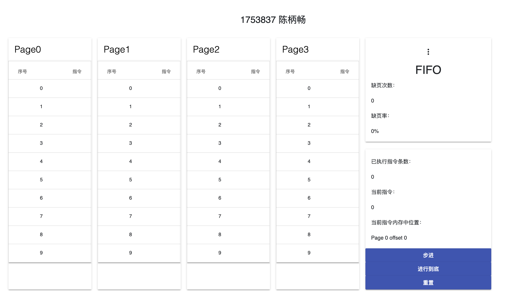
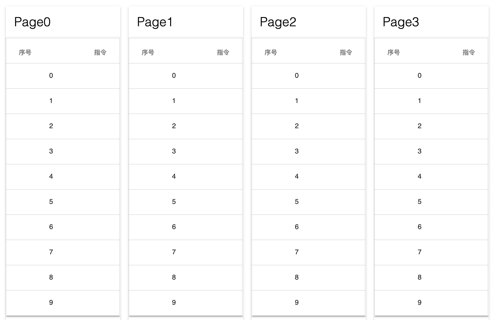
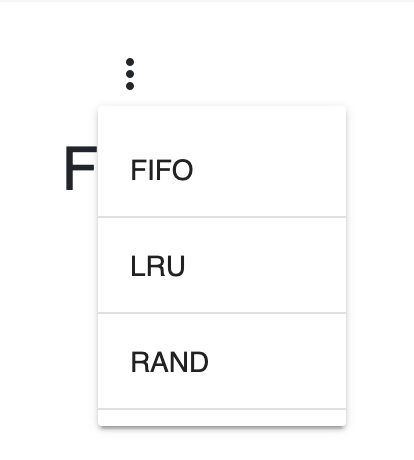
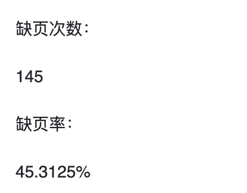
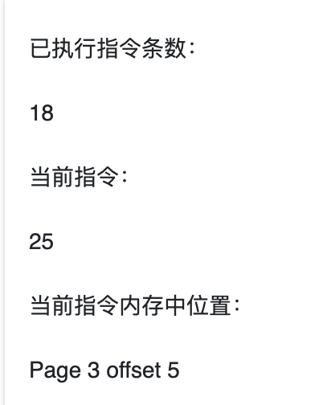
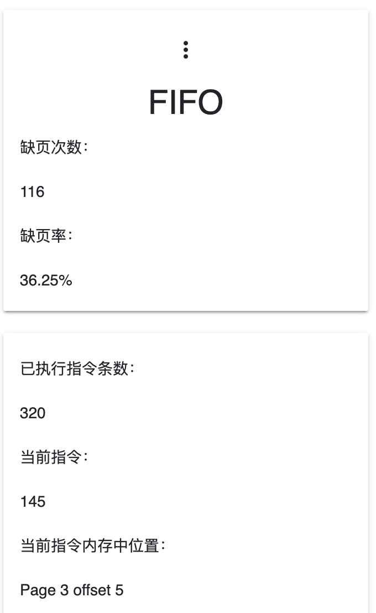
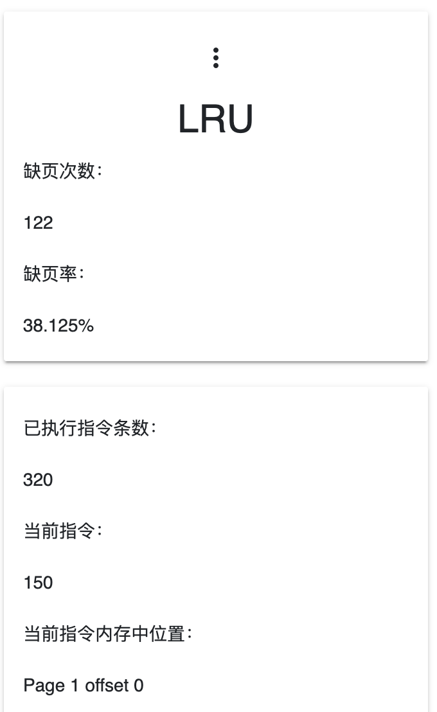
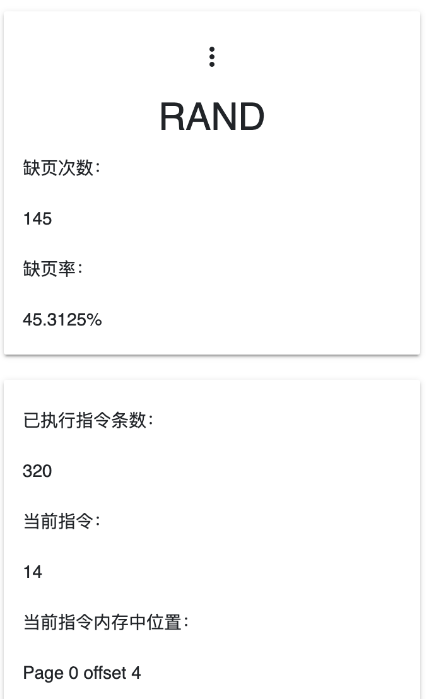

# 请求调页存储管理方式模拟

1753837 陈柄畅

## 运行

使用浏览器打开`index.html`

逻辑代码位于`main.js`

## 项目需求

* 假设每个页面可存放10条指令，分配给一个作业的内存块为4。

* 模拟一个作业的执行过程，该作业有320条指令，即它的地址空间为32页，目前所有页还没有调入内存。

* 在模拟过程中，如果所访问指令在内存中，则显示其物理地址，并转到下一条指令；如果没有在内存中，则发生缺页，此时需要记录缺页次数，并将其调入内存。如果4个内存块中已装入作业，则需进行页面置换。
* 50%的指令是顺序执行的，25%是均匀分布在前地址部分，25％是均匀分布在后地址部分

## 项目界面



* 左侧四列为四个内存页面，每页可存放10条指令。



* 右上方卡片上半部分为当前调度算法，并且可以从FIFO, LRU, RAND三者中选择一种。




* 右上方卡片下半部分为进行到当前缺页次数和缺页率。



* 右下方卡片上半部分分别为已执行指令条数，当前指令，当前指令在内存中的位置。



* 右下方卡片下半部分为控制按钮，可以控制程序步进，进行到底(执行全部320条指令)，重置。


## 实现

* 由于本次作业考察调页管理算法，所以对指令进行了相应的简化，仅用数字代表指令。

* 页结构实现。

  ```javascript
  class Page {
      constructor(id) {
          this.id = id;
          this.instruction_list = [];
      }
  
      checkInstruction(instruction_id) {
          if (this.instruction_list.indexOf(instruction_id) > -1) {
              return true;
          } else {
              return false;
          }
      }
  }
  ```

* 对于指令的随机跳转，我将随机数分为3段，0-0.5代表指令顺序执行，0.5-0.75代表指令向前跳转，0.75-1代表指令向后跳转。

  ```javascript
  getRandom = (start, end) => {
      var span = end - start;
      return Math.random() * span;
  }
  ```

* 对于不同的算法，我采用相同的数据结构存储指令，但使用不同的算法进行维护。

* 当不需要调入新的页面时，FIFO, RAND算法不需要再次对页面的指令序列进行修改。而LRU算法需要维护一个特殊的栈，将最新访问过的页面移至栈顶。

  ```javascript
  oneStep = (is_update_ui) => {
      if (step_number < 320) {
          var decision = getRandom(0, 1);
          if (decision <= 0.5) {
              current_instruction += 1;
          } else if (decision <= 0.75) {
              current_instruction = Math.floor(getRandom(0, current_instruction));
          } else {
              current_instruction = Math.floor(getRandom(current_instruction, 320));
          }
          var find_result = findInstructionInPages(current_instruction);
          if (find_result == -1) {
              loadNewPage(current_instruction);
          } else {
              if (algorithm_type == 1) {
                  lru_list.splice(lru_list.indexOf(current_page), 1);
                  lru_list.push(current_page);
              }
          }
          current_offset = current_instruction % 10;
          step_number += 1;
          if (is_update_ui) {
              updateUI();
          }
      }
  }
  ```

* 当需要调入新的页面时，FIFO，LRU算法需要将栈底的页面替换，并重新压入栈。但两者的栈不同，前者栈底记录着最早被调入的页面，后者栈底记录着最久未被访问的页面。RAND算法不需要记录。

  ```javascript
  loadNewPage = (instruction_id) => {
      if (algorithm_type == 0) {
          loadPage(fifo_list[0], instruction_id);
          current_page = fifo_list[0];
          fifo_list.push(fifo_list[0]);
          fifo_list.splice(0, 1);
      } else if (algorithm_type == 1) {
          loadPage(lru_list[0], instruction_id);
          current_page = lru_list[0];
          lru_list.push(lru_list[0]);
          lru_list.splice(0, 1);
      } else {
          current_page = Math.floor(getRandom(0, 4))
          loadPage(current_page, instruction_id);
      }
      lack_number += 1;
  }
  ```

## 实验结果

* FIFO



* LRU



* RAND




