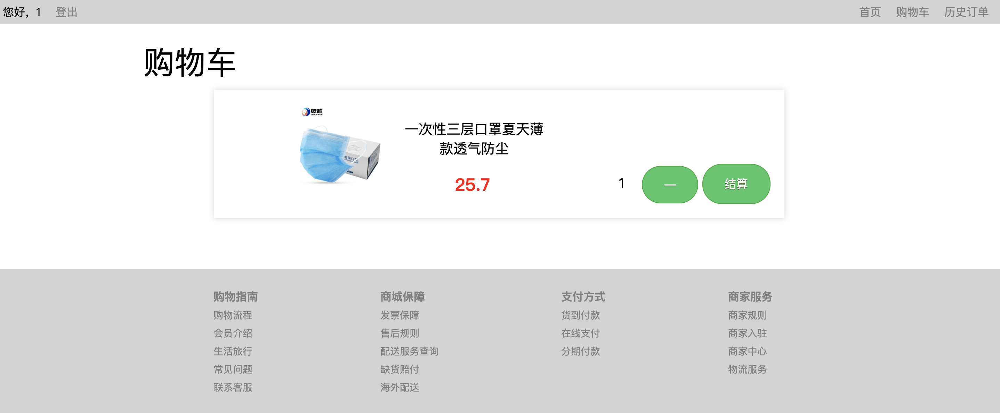

# TJMall

> 1753837
>
> 陈柄畅

[TOC]

## 概述

本项目实现了一个简易的静态网页商城（TJMall），并实现了一些简易的用户逻辑。

前端使用原生JS，以及HTML，CSS实现。后端使用Spring Boot搭建。数据库使用MySQL。

分别使用Nginx部署前端，Docker部署后端。

## 基础功能实现

### 商品缩略展示

#### 网页截图

#### 实现逻辑

页面在加载时，使用 ajax 发送异步请求到后端，后端返回商品的列表。前端在接收到 response 后，向 `productContainer` 中添加每一个商品卡片的模板 HTML 代码。

### 商品详情展示

#### 网页截图

#### 实现逻辑

商品信息和商品详情分别位于两个 `div` 中，在页面加载时，`js` 向后端请求数据，然后分别写入两个容器中。

### 用户注册

#### 网页截图

#### 实现逻辑

用户填写信息后，前端会简单地判断两次输入密码是否相同，如果相同，则将用户注册信息向后端发送。然后，接受后端的response，可能会出现用户名已被占用的情况，这时，会提示用户注册失败。如果注册成功，页面会直接跳转到登录界面。

### 用户登录

#### 网页截图

#### 实现逻辑

与注册功能实现逻辑相似，登录成功后，使用 `localStorage` 保存用户信息，同时会跳转到商城首页。

### 添加购物车

#### 网页截图

#### 实现逻辑

在商品详情页面，前端发送商品ID以及用户信息到后端。后端通过两者组成的唯一键在数据库中进行查找，如果用户之前已经添加过相同的商品，则将购物车中的商品数量加一，否则添加新的购物车商品。

### 登录状态结算下单

#### 实现逻辑

用户可以通过商品详情页和购物车页面分别进行结算下单，两者调用相同的后端接口。如果用户未登录，则跳转到登录界面。

### 登录状态查询历史订单信息

#### 网页截图

#### 实现逻辑

历史订单页在加载时向后端获取相应用户的信息，前端使用 `js` 向容器 `div` 中循环插入 `HTML` 模板。如果用户未登录，则跳转到登录界面。

## 加分项

### 部署

前端使用Nginx部署，后端使用Docker部署。

部署网址 http://abingcbc.cn:10030

### 轮播图

#### 网页截图

#### 主要功能

* 将三张展示图片横向拼接，使用 `setInterval` 定时移动，实现轮播效果。

* 设置左右两个移动键，可以切换上下图片。
* 鼠标放置在图片上时，停止自动轮播，即清空计时器。
* 右下角数字随图片变化

### 搜索

#### 网页截图

#### 主要功能

* 鼠标放置在搜索键上时，自动放大
* 根据关键词搜索商品并展示
* 当关键词为空时，自动返回首页

### 闹钟动画

#### 网页截图

#### 主要功能

使用动画关键帧，使得闹钟图片进行旋转，实现闹钟无限循环晃动

### 登出

#### 网页截图

#### 主要功能

清空浏览器中使用 `localStorage` 保存的用户信息

## 总结

经过这次Web作业，我摆脱了以往对于框架的依赖，使用原生JS实现静态网页，也使得我对Web技术的原理有了更加深入的认识。

在完成的过程中，我也遇到了一些比较经典的问题，所以在最后总结一下：

1. `div` 高度无法自适应

    在实现商品展示时，作为商品容器的 `div` 无法实现高度自适应，导致商品可能溢出边界或者空白边界过大的问题。最后使用 `

` ，使得解析器明确知道 `div` 已经结束，清除浮动。

2. 跨域访问

    在开发的最初阶段，我使用浏览器直接打开 `html` 文件进行开发。这就导致了使用 ajax 进行通信的时候没有域名，导致跨域访问的问题。所以，在之后的开发中，我使用 nginx 将前端静态网页进行一个本地的部署，模拟服务器中的环境。