# Web期末项目报告——WebCraft

> 1753837
>
> 陈柄畅

[TOC]

## 设计思路

MineCraft 是一款沙盒式建造游戏，本项目WebCraft是一款网页版的MineCraft游戏。实现了其中的大部分基础功能。

游戏玩法如下所示：

1. WASD / 方向键 控制移动

2. Q 开启/关闭创造模式

3. R / F 创造模式下上下移动

4. space 跳跃

5. esc 打开菜单

6. 鼠标移动控制视角

7. 鼠标左键创建方块

8. 鼠标右键消除方块

9. 鼠标滑轮切换方块

## 功能介绍

由于本项目的大多数功能都是动态效果，所以无配图部分请您参考演示视频。

### 前后左右移动

用户使用WASD 或者上下左右四个方向键控制移动。

实际上，用户在游戏中为一个相机，为了模拟第一人称的视角，采用的是下图中的第一种相机，将屏幕二维的视角转变为三维的。

用户在控制移动时，是在控制相机沿着x，y，z三个坐标轴进行移动

### 跳跃

用户使用空格键进行跳跃。

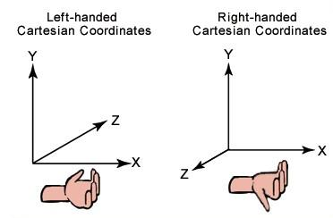

由于使用的框架 three.js 使用的是右手坐标系，所以跳跃时需要改变相机在世界坐标系中的坐标y的位置。但由于直接设置会产生一个瞬移的效果，影响游戏体验，所以需要对坐标进行递减或递增的更新。

### 视角变化

用户通过鼠标控制视角的变换。

我在实现视角变化时共实现了三个版本。第一个版本是根据鼠标在屏幕中的位置来判断视角变化方向，但这个版本与我的世界实际操控不同，所以舍弃。第二个版本使用鼠标的移动来判断，但该方案屏幕大小有限，而鼠标无法超出屏幕，导致视角变换范围有限，所以舍弃。第三个版本是在第二个版本上的改进，使用Chrome浏览器提供的Pointer Lock API，在鼠标移动的过程中，其位置不发生改变，但仍可以获取到其移动方向和轨迹。

### 添加方块

用户使用鼠标左键添加方块。

在添加方块时，需要判断要添加方块的位置，其原理是从相机发射一束射线，找到所有与该射线相交的所有物体，取最近的一个。但由于文档后续会有介绍的植物，用户可能在植物中，所以最近的一个可能就是用户当前所在的这个植物，所以这里需要额外的判断。

### 消除方块

用户使用鼠标右键消除方块。

实现逻辑与添加方块类似，但消除方块时，需要额外判断方块四周的方块是否需要展示。原因是在渲染的时候只会渲染表面的一层方块。

### 模拟物理碰撞

用户与方块之间有物理碰撞，无法穿过方块。

### 模拟光线

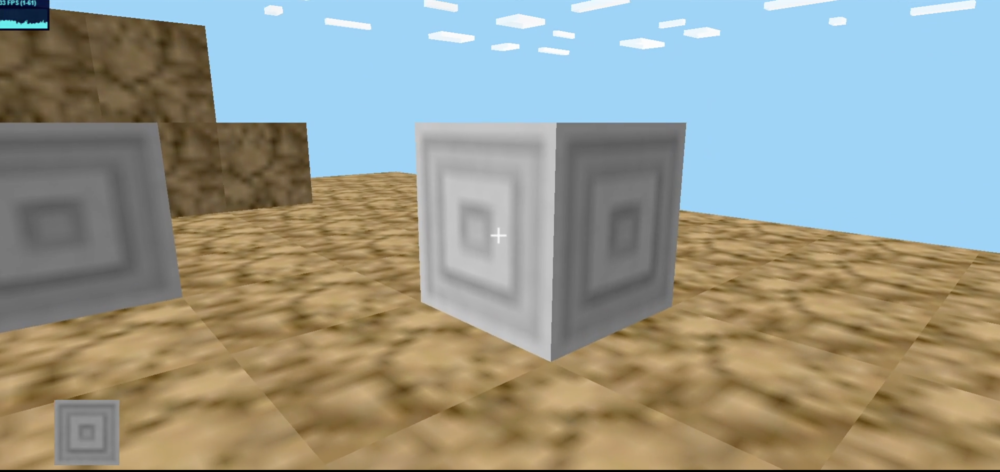

项目模拟了两种光线。一种为普通的环境光，使得所有方块可以被看见。一种为直射光，位于斜45度方向，模拟日照。图中可以看到，方块的两面明暗度不同。

### 不同模拟重力模式

项目有普通模式和创造模式两种形式。

在普通模式下，用户受重力约束，只能通过跳跃短暂离开地面。

在创造模式下，用户不受重力约束，可以通过R/F键上下移动。

### 不同样式方块

用户可以通过鼠标滚轮切换不同的方块样式，每种不同类型的方块在创建/删除的时候都有不同的音效。

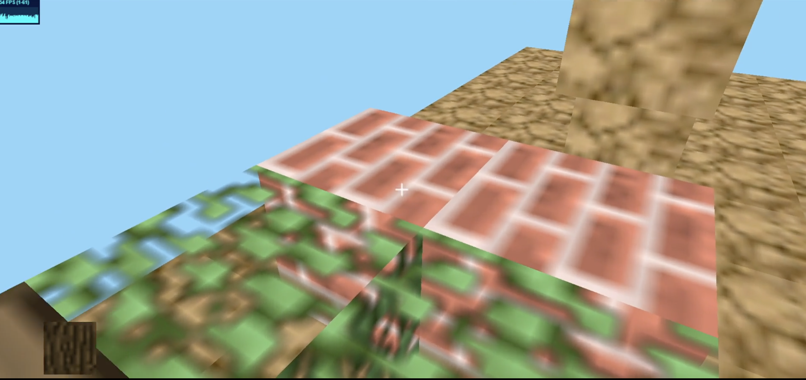

### 植物

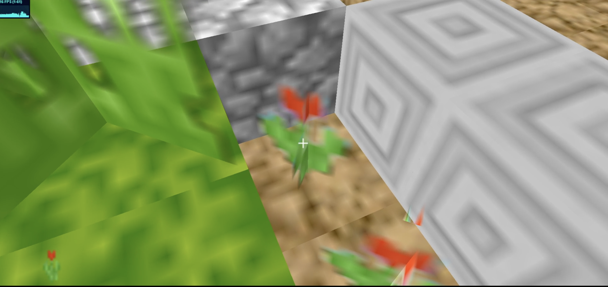

与其他方块不同的是，植物并不是一个立方体，而是由两个交叉面组成的，所以需要使用 Three.js 从底层构建一个几何体，然后进行贴图。

### 云

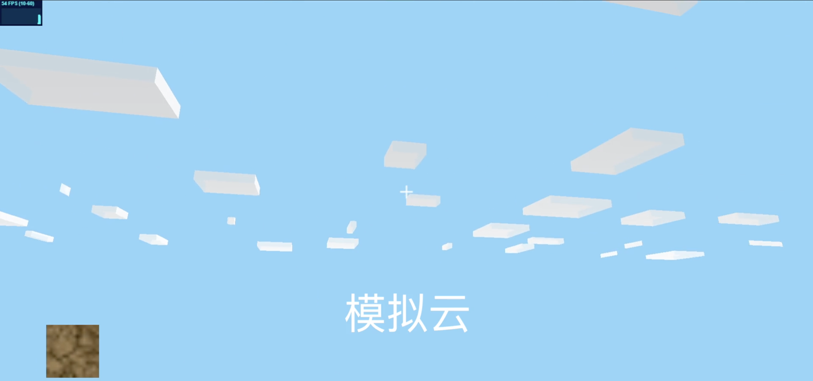

云是一种比较特殊的几何体，它不会被修改，而且可以穿过，所以在游戏的过程的无需对其进行维护。所以可以所有的云合并成一个几何体，从而对性能进行优化。

### 用户自定义地图大小

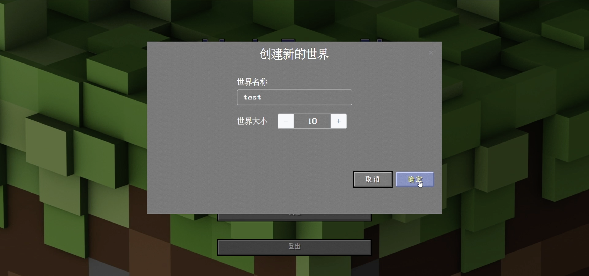

用户在创建地图时可以自定义地图大小。

### 保存地图

用户在对地图进行修改后，可以保存地图。如果未保存地图直接返回首页，会进行提醒。

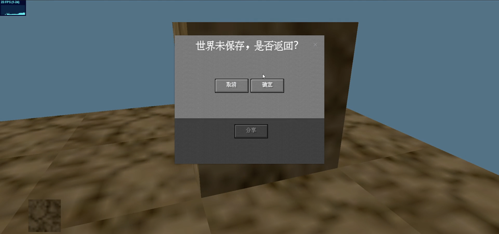

### 加载地图

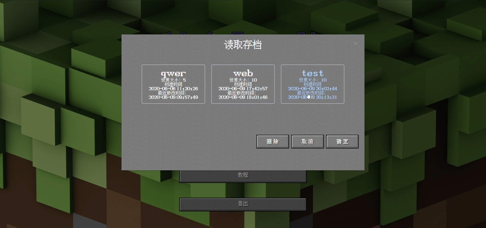

用户可以在首页选取之前保存的游戏存档，进行读取。

### 分享码

用户可以通过分享码，快速分享游戏地图。

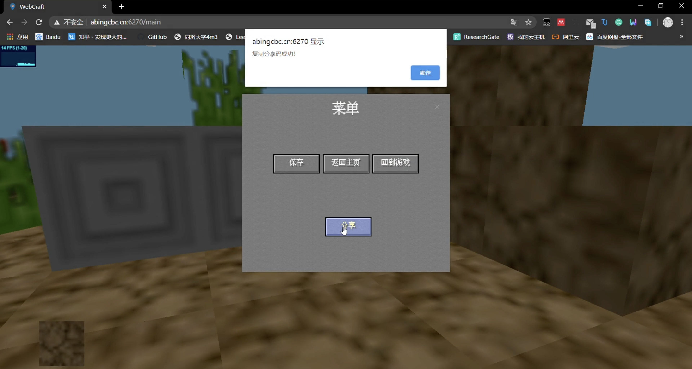

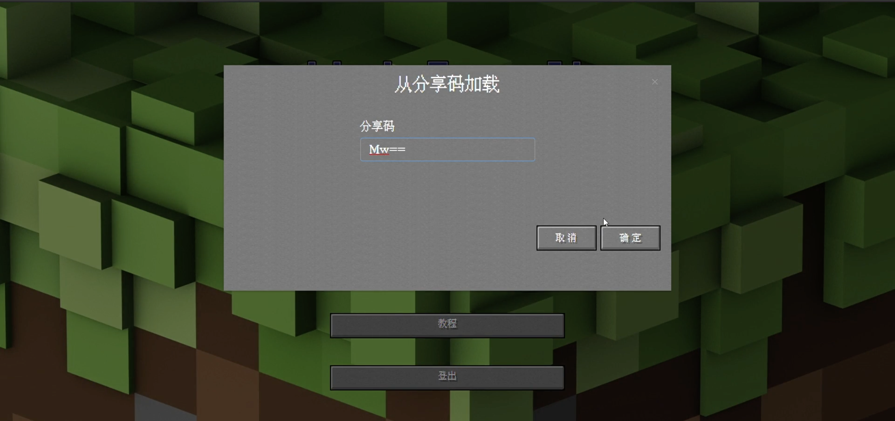

### 注册、登录

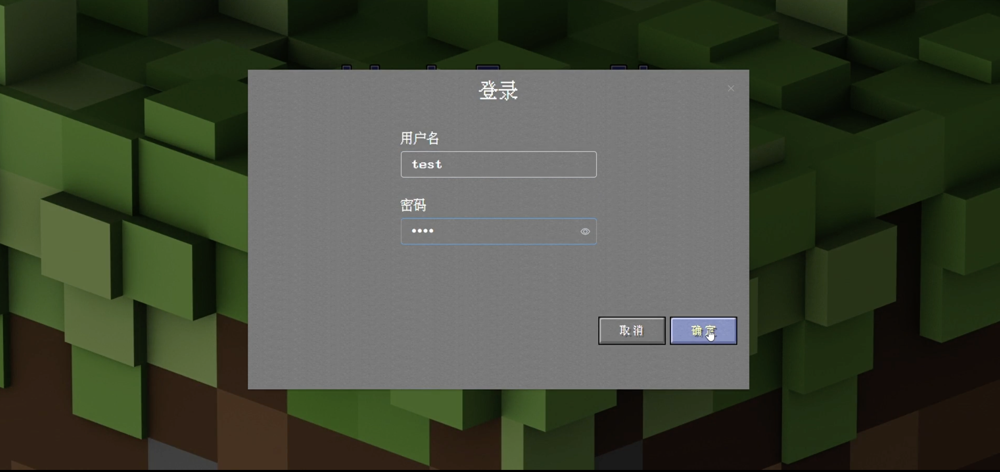

用户输入用户名和密码，以及再次确认密码，进行注册。

用户输入用户名和密码登录。

## 项目特点

1. 使用Chrome浏览器提供的Pointer Lock API
2. 性能优化：
    1. 地图渲染时只会渲染可见的一部分
    2. 地图存储采用了稀疏矩阵存储的CSR (Compressed Sparse Row) 的思想，对三维矩阵的第三维采用三元组的方式存储。
3. 支持分享码功能，解决 Minecraft 中常见的文件共享难题。

## 开发环境

前端开发框架：Vue.js, Three.js

后端开发框架：Spring Boot

前端部署：Nginx

后端部署：Docker